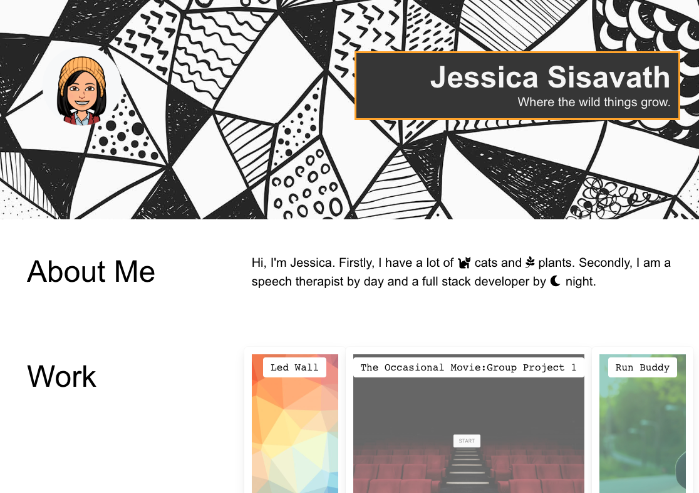

# My Epic Portfolio

## Description
A basic portfolio to showcase my current projects and highlight how cool said projects are.

## Table of Contents
  * [Site](#site)
  * [Questions](#questions)
  * [License](#license)

## Site

[Portfolio Github](https://github.com/Jessiferizzo/Professional-Portfolio.git)

[Jessica's Portfolio](https://jessiferizzo.github.io/Professional-Portfolio/) 

### Dependencies

HTML/CSS/Javascript/Bulma

## Authors

Jessica Sisavath

## Questions
  Please contact me using the following links:

  :octocat: Github [Jessiferizzo](https://github.com/jessiferizzo) 

  ✉️ [My Email](mailto:jsisavath2@gmail.com)

## Acknowledgments

Inspired and dedicated to my four cats

## License

This project is licensed under the MIT License